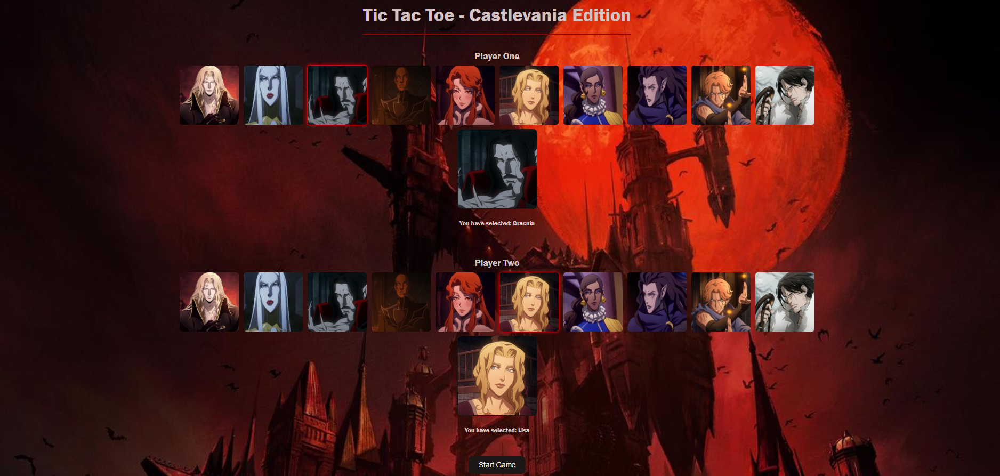
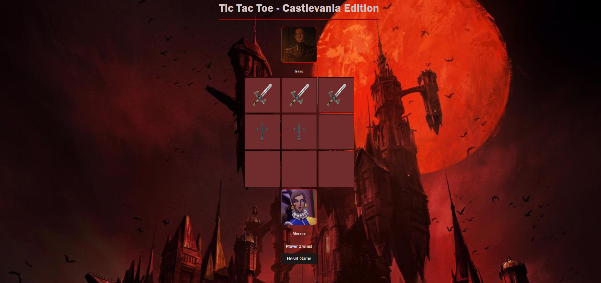

# Tic Tac Toe Castlevania

# Description
Tic Tac Toe game based on the popular Netflix Series Castlevania which was adopted by a videogame made by Konami. Two players can select their favorite Castlevania characters to play as before starting the game.

Players take turn placing their moves with their unique weapons and the first to get three in a row wins or the game ends in a draw

# Lessons Learned

- Using classes and objects in JavaScript to manage avatars and game state
- Creating and updating DOM elements dynamically
- Handling user input through click events
- Using conditional statements to check game-winning 
- Implementing responsive design with CSS flexbox and media queries
- Managing game state and UI updates (player turns, win/draw notifications)

# Tech Used

- HTML
- CSS
- JavaScript

# Challenge Review
- I completed the challenge: 4
- I feel good about my code: 4
- I think I could have done better with code reusuability. Will look into changing the code by using "this.name"
